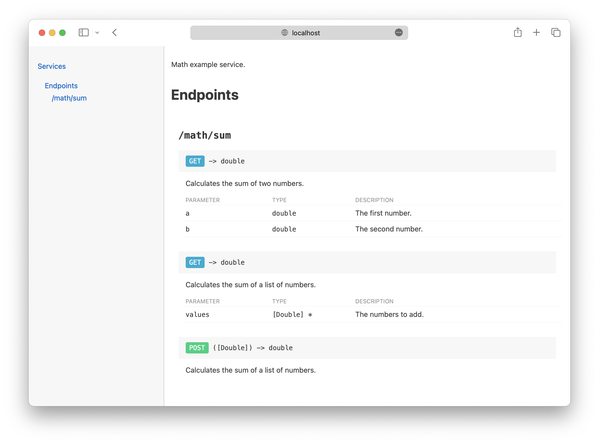

[](https://github.com/HTTP-RPC/Kilo/releases)
[](https://repo1.maven.org/maven2/org/httprpc/kilo-client/)
[](https://javadoc.io/doc/org.httprpc/kilo-client)

# Introduction
Kilo is an open-source framework for creating and consuming RESTful and REST-like web services in Java. It is extremely lightweight and requires only a Java runtime environment and a servlet container. The entire framework is less than 150KB in size, making it an ideal choice for applications where a minimal footprint is desired. 

The project's name comes from the nautical _K_ or _Kilo_ flag, which means "I wish to communicate with you":


This guide introduces the Kilo framework and provides an overview of its key features.

# Contents
* [Getting Kilo](#getting-kilo)
* [Kilo Classes](#kilo-classes)
* [Additional Information](#additional-information)

# Getting Kilo
Kilo is distributed via Maven Central: 

* [org.httprpc:kilo-client](https://repo1.maven.org/maven2/org/httprpc/kilo-client/) - provides support for consuming web services, interacting with relational databases, and working with common file formats (Java 17 or later required)
* [org.httprpc:kilo-server](https://repo1.maven.org/maven2/org/httprpc/kilo-server/) - depends on client; provides support for creating web services (Jakarta Servlet specification 5.0 or later required)

The following Gradle script will assemble a basic Java web application that includes support for Kilo-based web services:

```groovy
plugins {
    id 'war'
}

dependencies {
    compileOnly 'jakarta.servlet:jakarta.servlet-api:5.0.0'

    implementation "org.httprpc:kilo-server:${kiloVersion}"
}
```

# Kilo Classes
Classes provided by the Kilo framework include:

* [WebService](#webservice) - abstract base class for web services
* [WebServiceProxy](#webserviceproxy) - client-side invocation proxy for web services
* [JSONEncoder and JSONDecoder](#jsonencoder-and-jsondecoder) - encodes/decodes an object hierarchy to/from JSON
* [CSVEncoder and CSVDecoder](#csvencoder-and-csvdecoder) - encodes/decodes a sequence of map values to/from CSV
* [TextEncoder and TextDecoder](#textencoder-and-textdecoder) - encodes/decodes plain text content
* [TemplateEncoder](#templateencoder) - encodes an object hierarchy using a [template document](template-reference.md)
* [BeanAdapter](#beanadapter) - map adapter for Java beans
* [QueryBuilder and ResultSetAdapter](#querybuilder-and-resultsetadapter) - provides a fluent API for programmatically constructing and executing SQL queries/iterable adapter for JDBC result sets
* [ElementAdapter](#elementadapter) - map adapter for XML elements
* [ResourceBundleAdapter](#resourcebundleadapter) - map adapter for resource bundles
* [Pipe](#pipe) - facilitates communication between producer and consumer threads
* [Collections and Optionals](#collections-and-optionals) - utility methods for working with collections and optional values, respectively

Each is discussed in more detail in the following sections.

## WebService
`WebService` is an abstract base class for web services. It extends `HttpServlet` and provides a thin, REST-oriented layer on top of the standard servlet API.

Service operations are defined by adding public methods to a concrete service implementation. Methods are invoked by submitting an HTTP request for a path associated with a service instance. Arguments are provided either via the query string or in the request body, like an HTML form. `WebService` converts the arguments to the expected types, invokes the method, and writes the return value (if any) to the output stream as JSON. 

The `RequestMethod` annotation is used to associate a service method with an HTTP verb such as `GET` or `POST`. The optional `ResourcePath` annotation can be used to associate the method with a specific path relative to the servlet. If unspecified, the method is associated with the servlet itself.

Multiple methods may be associated with the same verb and path. `WebService` selects the best method to execute based on the provided argument values. For example, the following service class implements some simple mathematical operations:

```java
@WebServlet(urlPatterns = {"/math/*"}, loadOnStartup = 1)
public class MathService extends WebService {
    @RequestMethod("GET")
    @ResourcePath("sum")
    public double getSum(double a, double b) {
        return a + b;
    }

    @RequestMethod("GET")
    @ResourcePath("sum")
    public double getSum(List<Double> values) {
        double total = 0;

        for (double value : values) {
            total += value;
        }

        return total;
    }
}
```

This request would cause the first method to be invoked:

```
GET /math/sum?a=2&b=4
```
 
while this request would invoke the second method:

```
GET /math/sum?values=1&values=2&values=3
```

In either case, the service would return the value 6 in response. 

If no matching handler method is found for a given request, the default handler (e.g. `doGet()`) will be called.

At least one URL pattern is required, and it must be a path mapping (i.e. begin with a leading slash and end with a trailing slash and asterisk). It is recommended that services be configured to load automatically on startup. This ensures that they will be immediately available to [other services](#inter-service-communication) and included in the generated [documentation](#api-documentation).

### Method Parameters
Method parameters may be any of the following types:

* `String`
* `Byte`/`byte`
* `Short`/`short`
* `Integer`/`int`
* `Long`/`long`
* `Float`/`float`
* `Double`/`double`
* `Boolean`/`boolean`
* `java.util.Date` (from a long value representing epoch time in milliseconds)
* `java.time.Instant` ("yyyy-mm-ddThh:mm:ss[.sss]Z")
* `java.time.LocalDate` ("yyyy-mm-dd")
* `java.time.LocalTime` ("hh:mm")
* `java.time.LocalDateTime` ("yyyy-mm-ddThh:mm")
* `java.time.Duration`: ISO-8601 duration
* `java.time.Period`: ISO-8601 period
* `java.util.UUID`
* `java.util.List`
* `java.net.URL`

Unspecified values are automatically converted to `0` or `false` for primitive types.

`List` values are automatically converted to their declared types (e.g. `List<Double>`). If no arguments are provided for a list parameter, an empty list (not `null`) will be passed to the method.

`URL` and `List<URL>` parameters represent file uploads. They may be used only with `POST` requests submitted using the multi-part form data encoding. See the [file upload](https://github.com/HTTP-RPC/Kilo/blob/master/kilo-test/src/main/java/org/httprpc/kilo/test/FileUploadService.java) service example for more information.

If a provided value cannot be coerced to the expected type, an HTTP 403 (forbidden) response will be returned. If no method is found that matches the provided arguments, HTTP 405 (method not allowed) will be returned.

Note that service classes must be compiled with the `-parameters` flag so that parameter names are available at runtime.

#### Required Parameters
Parameters that must be provided by the caller can be indicated by the `Required` annotation. This annotation can also be applied to bean properties and record components, as discussed [later](#required-properties).

For example, the following service method accepts a single required `file` argument:

```java
@RequestMethod("POST")
@Description("Uploads a single file.")
public long uploadFile(
    @Description("The file to upload.") @Required URL file
) throws IOException {
    ...
}
```

`List` parameters are implicitly required, since a list argument will never be `null` (although it may be empty). For all other parameter types, HTTP 403 will be returned if a required value is not provided.

The `Description` annotation is discussed in more detail in the [API Documentation](#api-documentation) section.

### Path Variables
Path variables are specified by a "?" character in an endpoint's resource path:

```java
@RequestMethod("GET")
@ResourcePath("contacts/?")
public Contact getContact() { ... }
```

They may optionally be associated with a name or "key", as shown below:

```java
@RequestMethod("GET")
@ResourcePath("contacts/?:contactID")
public Contact getContact() { ... }
```

The value of a key can be obtained via one of the following methods:

```java
protected String getKey(int index) { ... }
protected <T> T getKey(int index, Class<T> type) { ... }

protected String getKey(String name) { ... }
protected <T> T getKey(String name, Class<T> type) { ... }
```

For example:

```java
var id = getKey("id", Integer.class);
```

### Custom Body Content
The `Content` annotation can be used to associate custom body content with a service method. Annotated methods can access decoded content via the `getBody()` method:

```java
@RequestMethod("POST")
@ResourcePath("items")
@Content(type = Item.class)
public Item addItem() throws SQLException {
    var item = (Item)getBody();

    ...
}
```

The `multiple` attribute of the `Content` annotation can be used to specify that the body is expected to contain a list of values of the given type. For example, this version of the `getSum()` method from the math service example takes input from the request body instead of the query string: 
:

```java
@RequestMethod("POST")
@ResourcePath("sum")
@Content(type = Double.class, multiple = true)
@SuppressWarnings("unchecked")
public double getSum() {
    return getSum((List<Double>)getBody());
}
```

By default, body data is assumed to be JSON and is automatically [converted](#type-coercion) to the specified type. However, subclasses can override the `decodeBody()` method to perform custom conversions.

### Return Values
Return values are converted to JSON as follows:

* `String`: string
* `Number` or numeric primitive: number
* `Boolean` or boolean primitive: true/false
* `Enum`: string
* `java.util.Date`: number representing epoch time in milliseconds
* `java.time.TemporalAccessor`: string
* `java.time.TemporalAmount`: string
* `java.util.UUID`: string
* `java.net.URL`: string
* `java.util.List`: array
* `java.util.Map` or any other type: object

By default, an HTTP 200 response is returned when a service method completes successfully. However, if a method returns `void` or `Void`, an HTTP 204 response will be returned. If a method returns `null`, HTTP 404 will be returned.

#### Custom Result Encodings
Although return values are encoded as JSON by default, subclasses can override the `encodeResult()` method of the `WebService` class to support alternative representations. See the method documentation for more information.

### Request and Repsonse Properties
The following methods provide access to the request and response objects associated with the current invocation:

```java
protected HttpServletRequest getRequest() { ... }
protected HttpServletResponse getResponse() { ... }
```

For example, a service might use the request to get the name of the current user, or use the response to return a custom header or status code.

The response object can also be used to produce a custom result. If a service method commits the response by writing to the output stream, the method's return value (if any) will be ignored by `WebService`. This allows a service to return content that cannot be easily represented as JSON, such as image data.

### Authorization
Service requests can be authorized by overriding the following method:

```java
protected boolean isAuthorized(HttpServletRequest request, Method method) { ... }
```

The first argument contains the current request, and the second the service method to be invoked. If `isAuthorized()` returns `true` (the default), method execution will proceed. Otherwise, the method will not be invoked, and an HTTP 403 response will be returned.

### Exceptions
If an exception is thrown by a service method and the response has not yet been committed, the exception message (if any) will be returned as plain text in the response body. Error status is returned as shown below:

* `IllegalArgumentException` or `UnsupportedOperationException` - HTTP 403 (forbidden)
* `NoSuchElementException` - HTTP 404 (not found)
* `IllegalStateException` - HTTP 409 (conflict)
* Any other exception - HTTP 500 (internal server error)

### Inter-Service Communication
A reference to any service annotated with `jakarta.servlet.annotation.WebServlet` can be obtained via the `getInstance()` method of the `WebService` class. This can be useful when the implementation of one service depends on functionality provided by another service, for example.

### API Documentation
An index of all active services can be found at the application's context root; for example:

```
GET http://localhost:8080/kilo-test
```


Documentation for a specific service can be viewed by appending "?api" to the service's base URL:

```
GET http://localhost:8080/kilo-test/math?api
```



Endpoints are grouped by resource path. Implementations can provide additional information about service types and operations using the `Description` annotation. For example:

```java
@WebServlet(urlPatterns = {"/math/*"}, loadOnStartup = 1)
@Description("Math example service.")
public class MathService extends WebService {
    @RequestMethod("GET")
    @ResourcePath("sum")
    @Description("Calculates the sum of two numbers.")
    public double getSum(
        @Description("The first number.") double a,
        @Description("The second number.") double b
    ) {
        return a + b;
    }

    ...
}
```

Descriptions can also be associated with bean types, enumerations, and records:

```java
@Description("Represents an item in the catalog.")
public interface Item {
    @Key("id")
    @Description("The item's ID.")
    Integer getID();
    void setID(Integer id);

    @Description("The item's description.")
    String getDescription();

    @Description("The item's price.")
    Double getPrice();
}
```

```java
@Description("Represents a size option.")
public enum Size {
    @Description("A small size.")
    SMALL,
    @Description("A medium size.")
    MEDIUM,
    @Description("A large size.")
    LARGE
}
```  

```java
@Description("Represents an x/y coordinate pair.")
public record Coordinates(
    @Description("The x-coordinate.") @Required int x,
    @Description("The y-coordinate.") @Required int y
) {
}
```

#### Keys
The `Keys` annotation can be used to provide descriptions for an endpoint's keys. For example:

```java
@RequestMethod("PUT")
@ResourcePath("items/?:itemID")
@Description("Updates an item.")
@Keys({"The item ID."})
@Content(type = Item.class)
public void updateItem() throws SQLException {
    var item = (Item)getBody();

    ... 
}
```

#### Internal/Deprecated Methods
Service types or methods that are not considered public can be tagged with the `Internal` annotation. This designation will be reflected in the generated documentation. Types or methods tagged with the `Deprecated` annotation will also be identified as such in the output.

#### JSON Documentation
A JSON version of the generated documentation can be obtained by specifying an "Accept" type of "application/json" in the request headers. The response can be used to process an API definition programatically; for example, to generate client-side stub code. 

## WebServiceProxy
The `WebServiceProxy` class is used to submit API requests to a server. It provides a single constructor that accepts the following arguments:

* `method` - the HTTP method to execute
* `url` - the URL of the requested resource

Request arguments are specified via the `setArguments()` method. Like HTML forms, arguments are submitted either via the query string or in the request body. Arguments for `GET`, `PUT`, and `DELETE` requests are always sent in the query string. `POST` arguments are typically sent in the request body, and may be submitted as either "application/x-www-form-urlencoded" or "multipart/form-data" (specified via the proxy's `setEncoding()` method). 

Any value may be used as an argument and will generally be encoded using its string representation. However, `Date` instances are automatically converted to a long value representing epoch time. Additionally, `List` instances represent multi-value parameters and behave similarly to `<select multiple>` tags in HTML. When using the multi-part encoding, instances of `URL` represent file uploads and behave similarly to `<input type="file">` tags in HTML forms.

Custom body content can be provided via the `setBody()` method. By default, body data is serialized as JSON; however, the `setRequestHandler()` method can be used to facilitate custom encodings:

```java
public interface RequestHandler {
    String getContentType();
    void encodeRequest(OutputStream outputStream) throws IOException;
}
```

If either a custom body or request handler is specified, `POST` arguments will be sent in the query string.

Service operations are invoked via one of the following methods:

```java
public Object invoke() throws IOException { ... }
public <T> T invoke(Class<T> rawType, Type... actualTypeArguments) throws IOException { ... }
public <T> T invoke(ResponseHandler<T> responseHandler) throws IOException { ... }
```

The first two versions automatically deserialize a successful JSON response (if any). The third allows a caller to provide a custom response handler:

```java
public interface ResponseHandler<T> {
    T decodeResponse(InputStream inputStream, String contentType) throws IOException;
}
```

If a service returns an error response, the default error handler will throw a `WebServiceException`. If the content type of the error response is "text/*", the deserialized response body will be provided in the exception message. A custom error handler can be supplied via `setErrorHandler()`:

```java
public interface ErrorHandler {
    void handleResponse(InputStream errorStream, String contentType, int statusCode) throws IOException;
}
```

The following code demonstrates how `WebServiceProxy` might be used to access the operations of the simple math service discussed earlier:

```java
var webServiceProxy = WebServiceProxy.get(new URL(baseURL, "math/sum"));

// GET /math/sum?a=2&b=4
webServiceProxy.setArguments(mapOf(
    entry("a", 4),
    entry("b", 2)
));

System.out.println(webServiceProxy.invoke(Double.class)); // 6.0

// GET /math/sum?values=1&values=2&values=3
webServiceProxy.setArguments(mapOf(
    entry("values", listOf(1, 2, 3))
));

System.out.println(webServiceProxy.invoke(Double.class)); // 6.0
```

### Fluent Invocation
`WebServiceProxy` supports a fluent (i.e. "chained") invocation model. For example, the following code is functionally equivalent to the previous version:

```java
// GET /math/sum?a=2&b=4
System.out.println(WebServiceProxy.get(baseURL, "math/sum").setArguments(mapOf(
    entry("a", 4),
    entry("b", 2)
)).invoke(Double.class)); // 6.0

// GET /math/sum?values=1&values=2&values=3
System.out.println(WebServiceProxy.get(baseURL, "math/sum").setArguments(mapOf(
    entry("values", listOf(1, 2, 3))
)).invoke(Double.class)); // 6.0
```

POST, PUT, and DELETE operations are also supported.

### Monitoring Service Invocations
Service request and response data can be captured by setting the monitor stream on a proxy instance. For example:

```java
List<Number> result = WebServiceProxy.get(baseURL, "test/fibonacci").setArguments(
    mapOf(
        entry("count", 8)
    )
).setMonitorStream(System.out).invoke();
```

This code would produce output similar to the following:

```
GET http://localhost:8080/kilo-test/test/fibonacci?count=8
Accept-Language: en-us
HTTP 200
Keep-Alive: timeout=20
Transfer-Encoding: chunked
vary: accept-encoding
Connection: keep-alive
Date: Wed, 10 May 2023 15:52:55 GMT
Content-Type: application/json;charset=UTF-8
[
  0,
  1,
  1,
  2,
  3,
  5,
  8,
  13
]
```

## JSONEncoder and JSONDecoder
The `JSONEncoder` class is used internally by `WebService` and `WebServiceProxy` to serialize request and response data. However, it can also be used directly by application logic. For example: 

```java
var map = mapOf(
    entry("vegetables", listOf(
        "carrots", 
        "peas", 
        "potatoes"
    )),
    entry("desserts", listOf(
        "cookies",
        "cake",
        "ice cream"
    ))
);

var jsonEncoder = new JSONEncoder();

jsonEncoder.write(map, System.out);
```

This code would produce the following output:

```json
{
  "vegetables": [
    "carrots",
    "peas",
    "potatoes"
  ],
  "desserts": [
    "cookies",
    "cake",
    "ice cream"
  ]
}
``` 

Values are converted to their JSON equivalents as described [earlier](#return-values). Note that Java bean values must first be wrapped in an instance of `BeanAdapter`, which is discussed in more detail [later](#beanadapter). `BeanAdapter` implements the `Map` interface, which allows `JSONEncoder` to serialize the values as JSON objects. `ResultSetAdapter` (also discussed [later](#querybuilder-and-resultsetadapter)) provides a similar capability for JDBC result sets. 

`JSONDecoder` deserializes a JSON document into an object hierarchy. JSON values are mapped to their Java equivalents as follows:

* string: `String`
* number: `Number`
* true/false: `Boolean`
* array: `java.util.List`
* object: `java.util.Map`

For example, given the following document:

```json
[
  {
    "name": "January",
    "days": 31
  },
  {
    "name": "February",
    "days": 28
  },
  {
    "name": "March",
    "days": 31
  },
  ...
]
```

`JSONDecoder` could be used to parse the data into a list of maps as shown below:

```java
var jsonDecoder = new JSONDecoder();

var months = (List<Map<String, Object>>)jsonDecoder.read(inputStream);

for (var month : months) {
    System.out.println(String.format("%s has %s days", month.get("name"), month.get("days")));
}
```

## CSVEncoder and CSVDecoder
The `CSVEncoder` class can be used to serialize a sequence of map values to CSV. For example, the month/day count list from the previous section could be exported to CSV as shown below. The string values passed to the constructor represent both the columns in the output document and the map keys to which those columns correspond:

```java
var csvEncoder = new CSVEncoder(listOf("name", "days"));

csvEncoder.write(months, System.out);
```

This code would produce the following output:

```csv
"name","days"
"January",31
"February",28
"March",31
...
```

String values are automatically wrapped in double-quotes and escaped. Instances of `java.util.Date` are encoded as a long value representing epoch time. All other values are encoded via `toString()`. 

`CSVDecoder` deserializes a CSV document into a list of map values. For example, given the preceding document as input, this code would produce the same output as the `JSONDecoder` example:

```java
var csvDecoder = new CSVDecoder();

var months = csvDecoder.read(inputStream);

for (var month : months) {
    System.out.println(String.format("%s has %s days", month.get("name"), month.get("days")));
}
```

## TextEncoder and TextDecoder
The `TextEncoder` and `TextDecoder` classes can be used to serialize and deserialize plain text content, respectively. For example:

```java
try (var outputStream = new FileOutputStream(file)) {
    var textEncoder = new TextEncoder();
    
    textEncoder.write("Hello, World!", outputStream);
}

String text;
try (var inputStream = new FileInputStream(file)) {
    var textDecoder = new TextDecoder();

    text = textDecoder.read(inputStream);
}

System.out.println(text); // Hello, World!
```

## TemplateEncoder
The `TemplateEncoder` class transforms an object hierarchy into an output format using a [template document](template-reference.md). Template syntax is based loosely on the [Mustache](https://mustache.github.io) format and supports most Mustache features. 

`TemplateEncoder` provides the following constructors:

```java
public TemplateEncoder(URL url) { ... }
public TemplateEncoder(URL url, ResourceBundle resourceBundle) { ... }
```

Both versions accept an argument specifying the location of the template document (typically as a resource on the application's classpath). The second version additionally accepts an optional resource bundle that, when present, is used to resolve resource markers. 

An escape [modifier](#custom-modifiers) corresponding to the document's extension will be automatically applied to injected values, if available. HTML and XML are supported by default.

Templates are applied via one of the following methods:

```java
public void write(Object value, OutputStream outputStream) { ... }
public void write(Object value, OutputStream outputStream, Locale locale) { ... }
public void write(Object value, OutputStream outputStream, Locale locale, TimeZone timeZone) { ... }
public void write(Object value, Writer writer) { ... }
public void write(Object value, Writer writer, Locale locale) { ... }
public void write(Object value, Writer writer, Locale locale, TimeZone timeZone) { ... }
```

The first argument represents the value to write (i.e. the data dictionary), and the second the output destination. The optional third and fourth arguments represent the target locale and time zone, respectively. If unspecified, system defaults are used.

For example, this code applies a template named "example.txt" to a map instance:

```java
var map = mapOf(
    entry("a", "hello"),
    entry("b", 123),
    entry("c", true)
);

var templateEncoder = new TemplateEncoder(getClass().getResource("example.txt"));

templateEncoder.write(map, System.out);
```

If "example.txt" was written as follows:

```
{{a}}, {{b}}, {{c}}
```

the resulting output would look like this:

```
hello, 123, true
```

### Custom Modifiers
[Modifiers](template-reference.md#modifiers) are created by implementing the `TemplateEncoder.Modifier` interface, which defines a single `apply()` method:

```java
public interface Modifier {
    Object apply(Object value, String argument, Locale locale, TimeZone timeZone);
}
```
 
The first argument to the method represents the value to be modified, and the second is the optional argument value following the "=" character in the modifier string. If an argument is not specified, this value will be `null`. The third argument contains the encoder's locale.

Custom modifiers are added to a template encoder instance via the `getModifiers()` method. For example, the following code creates a modifier that converts values to uppercase:

```java
var templateEncoder = new TemplateEncoder(getClass().getResource("modifier.txt"));

templateEncoder.getModifiers().put("uppercase", (value, argument, locale, timeZone) -> value.toString().toUpperCase(locale));

templateEncoder.write(mapOf(
    entry("text", "hello")
), System.out);
```

The output of this code would be "HELLO".

## BeanAdapter
The `BeanAdapter` class provides access to Java bean properties via the `Map` interface. For example, the following class might be used to represent a node in a hierarchical object graph:

```java
public class TreeNode {
    private String name;
    private List<TreeNode> children;

    public TreeNode() {
        this(null, null);
    }

    public TreeNode(String name, List<TreeNode> children) {
        this.name = name;
        this.children = children;
    }

    public String getName() {
        return name;
    }

    public void setName(String name) {
        this.name = name;
    }

    public List<TreeNode> getChildren() {
        return children;
    }

    public void setChildren(List<TreeNode> children) {
        this.children = children;
    }
}
```

A simple tree structure could be created and serialized to JSON as shown below:

```java
var root = new TreeNode("Seasons", listOf(
    new TreeNode("Winter", listOf(
        new TreeNode("January", null),
        new TreeNode("February", null),
        new TreeNode("March", null)
    )),
    new TreeNode("Spring", listOf(
        new TreeNode("April", null),
        new TreeNode("May", null),
        new TreeNode("June", null)
    )),
    new TreeNode("Summer", listOf(
        new TreeNode("July", null),
        new TreeNode("August", null),
        new TreeNode("September", null)
    )),
    new TreeNode("Fall", listOf(
        new TreeNode("October", null),
        new TreeNode("November", null),
        new TreeNode("December", null)
    ))
));

var jsonEncoder = new JSONEncoder();

jsonEncoder.write(new BeanAdapter(root), writer);
```

The resulting output would look something like this (`BeanAdapter` traverses properties in alphabetical order):

```json
{
  "children": [
    {
      "children": [
        {
          "children": null,
          "name": "January"
        },
        {
          "children": null,
          "name": "February"
        },
        {
          "children": null,
          "name": "March"
        }
      ],
      "name": "Winter"
    },
    ...
  ],
  "name": "Seasons"
}
```

### Type Coercion
`BeanAdapter` can also be used to facilitate type-safe access to loosely typed data structures, such as decoded JSON objects:

```java
public static <T> T coerce(Object value, Class<T> rawType, Type... actualTypeArguments) { ... }
```

For example, the following code could be used to deserialize the JSON data generated by the previous example back into a collection of `TreeNode` instances:

```java
var jsonDecoder = new JSONDecoder();

var root = BeanAdapter.coerce(jsonDecoder.read(reader), TreeNode.class);

System.out.println(root.getName()); // Seasons
System.out.println(root.getChildren().get(0).getName()); // Winter
System.out.println(root.getChildren().get(0).getChildren().get(0).getName()); // January
```

Note that an interface can be used instead of a class to provide a strongly typed "view" of the underlying map data. For example:

```java
public interface Employee {
    Integer getEmployeeNumber();
    String getFirstName();
    String getLastName();
    String getGender();
    LocalDate getBirthDate();
    LocalDate getHireDate();
}
```

```java
var map = mapOf(
    entry("employeeNumber", 10001),
    entry("firstName", "Georgi"),
    entry("lastName", "Facello"),
    entry("gender", "M"),
    entry("birthDate", "1953-09-02"),
    entry("hireDate", "1986-06-26")
);

var employee = BeanAdapter.coerce(map, Employee.class);

System.out.println(employee.getEmployeeNumber()); // 10001
System.out.println(employee.getFirstName()); // Georgi
System.out.println(employee.getLastName()); // Facello
System.out.println(employee.getGender()); // M
System.out.println(employee.getBirthDate()); // 1953-09-02
System.out.println(employee.getHireDate()); // 1986-06-26
```

Mutator methods are also supported.

### Custom Property Keys
The `Key` annotation can be used to associate a custom name with a bean property or record component. For example:

```java
public class Person {
    private String firstName = null;
    private String lastName = null;

    @Key("first_name")
    public String getFirstName() {
        return firstName;
    }

    public void setFirstName(String firstName) {
        this.firstName = firstName;
    }

    @Key("last_name")
    public String getLastName() {
        return lastName;
    }

    public void setLastName(String lastName) {
        this.lastName = lastName;
    }
}
```

The preceding class would be serialized to JSON like this:

```json
{
  "first_name": "John",
  "last_name": "Smith"
}
```

rather than this:

```json
{
  "firstName": "John",
  "lastName": "Smith"
}
```

### Required Properties
The `Required` annotation introduced [previously](#required-parameters) can also be used to indicate that a bean property or record component must contain a value. For example:

```java
public class Vehicle {
    private String manufacturer;
    private Integer year;

    @Required
    public String getManufacturer() {
        return manufacturer;
    }

    public void setManufacturer(String manufacturer) {
        this.manufacturer = manufacturer;
    }

    @Required
    public Integer getYear() {
        return year;
    }

    public void setYear(Integer year) {
        this.year = year;
    }
}
```

Because both "manufacturer" and "year" are required, an attempt to coerce an empty map to a `Vehicle` instance would produce an `IllegalArgumentException`:

```java
var vehicle = BeanAdapter.coerce(mapOf(), Vehicle.class); // throws
```

Additionally, although the annotation will not prevent a caller from programmatically assigning a `null` value to either property, attempting to dynamically set an invalid value will generate an `IllegalArgumentException`:

```java
var vehicle = new Vehicle();

var vehicleAdapter = new BeanAdapter(vehicle);

vehicleAdapter.put("manufacturer", null); // throws
```

Similarly, attempting to dynamically access an invalid value will result in an `UnsupportedOperationException`:

```java
vehicleAdapter.get("manufacturer"); // throws
```

Note that, unlike [list parameters](#required-parameters), list properties are not guaranteed to contain a non-`null` value and must be explicitly annotated when required.

### Ignoring Properties
The `Ignore` annotation can be used to indicate that a property should be ignored by `BeanAdapter`. For example, given the following code:

```java
@Ignore
public Object getIgnored() {
    ...
}
```

a call to `get()` with a key of "ignored" would return `null`. The value would also be omitted when traversing the map's contents. 

Attempting to `put()` an ignored value will result in an `UnsupportedOperationException`. 

## QueryBuilder and ResultSetAdapter
The `QueryBuilder` class provides a fluent API for programmatically constructing and executing SQL queries. For example, given the following table from the MySQL sample database:

```sql
create table pet (
  name varchar(20),
  owner varchar(20),
  species varchar(20),
  sex char(1),
  birth date,
  death date
);
```

this code could be used to create a query that returns all columns and rows in the table:

```java
QueryBuilder.select("*").from("pet");
```

The resulting SQL would look like this:

```sql
select * from pet
```

To select only rows associated with a particular owner, the following query could be used:

```java
QueryBuilder.select("*").from("pet").where("owner = :owner");
```

The colon character identifies "owner" as a parameter, or variable. The resulting SQL would look like this:

```sql
select * from pet where owner = ?
```

Parameter values, or arguments, can be passed to `QueryBuilder`'s `executeQuery()` method as shown below:

```java
try (var statement = queryBuilder.prepare(getConnection());
    var results = new ResultSetAdapter(queryBuilder.executeQuery(statement, mapOf(
        entry("owner", owner)
    )))) {
    ...
}
```

The `ResultSetAdapter` class provides access to the contents of a JDBC result set via the `Iterable` interface. Individual rows are represented by `Map` instances produced by the adapter's iterator. This approach is well-suited to serializing large amounts of data, as it does not require any intermediate buffering and has low latency:

```java
var jsonEncoder = new JSONEncoder();

jsonEncoder.write(results, response.getOutputStream());
```

However, for smaller data sets, the following more concise alternative can be used:

```java
var results = queryBuilder.execute(getConnection(), mapOf(
    entry("owner", owner)
)).getResults();
```

The results could then be mapped to a list of `Pet` instances and returned from a service method as follows:

```java
public interface Pet {
    String getName();
    String getOwner();
    String getSpecies();
    String getSex();
    Date getBirth();
    Date getDeath();
}
```

```java
return BeanAdapter.coerce(results, List.class, Pet.class);
```

Insert, update, and delete operations are also supported. See the [pet](https://github.com/HTTP-RPC/Kilo/tree/master/kilo-test/src/main/java/org/httprpc/kilo/test/PetService.java) or [catalog](https://github.com/HTTP-RPC/Kilo/tree/master/kilo-test/src/main/java/org/httprpc/kilo/test/CatalogService.java) service examples for more information.

## ElementAdapter
The `ElementAdapter` class provides access to the contents of an XML DOM `Element` via the `Map` interface. For example, the following markup might be used to represent the status of a bank account:

```xml
<account id="101">
    <holder>
        <firstName>John</firstName>
        <lastName>Smith</lastName>
    </holder>
    <transactions>
        <credit>
            <amount>100.00</amount>
            <date>10/5/2020</date>
        </credit>
        <credit>
            <amount>50.00</amount>
            <date>10/12/2020</date>
        </credit>
        <debit>
            <amount>25.00</amount>
            <date>10/14/2020</date>
        </debit>
        <credit>
            <amount>75.00</amount>
            <date>10/19/2020</date>
        </credit>
    </transactions>
</account>
```

This code could be used to load the document and adapt the root element: 

```java
var documentBuilderFactory = DocumentBuilderFactory.newInstance();

documentBuilderFactory.setExpandEntityReferences(false);
documentBuilderFactory.setIgnoringComments(true);

var documentBuilder = documentBuilderFactory.newDocumentBuilder();

Document document;
try (var inputStream = getClass().getResourceAsStream("account.xml")) {
    document = documentBuilder.parse(inputStream);
}

var accountAdapter = new ElementAdapter(document.getDocumentElement());
```

Attribute values can be obtained by prepending an "@" symbol to the attribute name:

```java
var id = accountAdapter.get("@id");

System.out.println(id); // 101
```

Individual sub-elements can be accessed by name. The text content of an element can be obtained by calling `toString()` on the returned adapter instance; for example:

```java
var holder = (Map<String, Object>)accountAdapter.get("holder");

var firstName = holder.get("firstName");
var lastName = holder.get("lastName");

System.out.println(String.format("%s, %s", lastName, firstName)); // Smith, John
```

An element's text content can also be accessed via the reserved "." key.

Multiple sub-elements can be obtained by appending an asterisk to the element name:

```java
var transactions = (Map<String, Object>)accountAdapter.get("transactions");
var credits = (List<Map<String, Object>>)transactions.get("credit*");

for (var credit : credits) {
    System.out.println(credit.get("amount"));
    System.out.println(credit.get("date"));
}
```

`ElementAdapter` also supports `put()` and `remove()` for modifying an element's contents.

## ResourceBundleAdapter
The `ResourceBundleAdapter` class provides access to the contents of a resource bundle via the `Map` interface. It can be used to localize the headings in a CSV document, for example:

```
name = Name
description = Description
quantity = Quantity
```

```java
var csvEncoder = new CSVEncoder(listOf("name", "description", "quantity"));

var resourceBundle = ResourceBundle.getBundle(getClass().getPackageName() + ".labels");

csvEncoder.setLabels(new ResourceBundleAdapter(resourceBundle));

csvEncoder.write(listOf(
    mapOf(
        entry("name", "Item 1"),
        entry("description", "Item number 1"),
        entry("quantity", 3)
    ),
    mapOf(
        entry("name", "Item 2"),
        entry("description", "Item number 2"),
        entry("quantity", 5)
    ),
    mapOf(
        entry("name", "Item 3"),
        entry("description", "Item number 3"),
        entry("quantity", 7)
    )
), System.out);
```

This code would produce the following output:

```csv
"Name","Description","Quantity"
"Item 1","Item number 1",3
"Item 2","Item number 2",5
"Item 3","Item number 3",7
```

## Pipe
The `Pipe` class provides a vehicle by which a producer thread can submit a sequence of elements for retrieval by a consumer thread. It implements the `List` interface and produces an iterator that returns values as they become available, blocking if necessary.

For example, the following code constructs a SQL query that retrieves all rows from an `employees` table:

```java
var queryBuilder = QueryBuilder.select(
    "emp_no as employeeNumber",
    "first_name as firstName",
    "last_name as lastName",
    "gender",
    "birth_date as birthDate",
    "hire_date as hireDate"
).from("employees");
```

This code could be used to transform the results to a list of `Employee` instances:

```java
try (var connection = getConnection()) {
    return BeanAdapter.coerce(queryBuilder.execute(connection).getResults(), List.class, Employee.class);
}
```

All rows are processed and added to the list before anything is returned to the caller. For small result sets, the latency and memory implications associated with this approach might be acceptable. However, for larger data volumes the following alternative may be preferable. The query is executed on a background thread, and the transformed results are streamed back to the caller via a pipe:

```java
var pipe = new Pipe<Employee>(4096, 15000);

executorService.submit(() -> {
    try (var connection = getConnection();
        var statement = queryBuilder.prepare(connection);
        var resultSet = queryBuilder.executeQuery(statement, mapOf());
        var resultSetAdapter = new ResultSetAdapter(resultSet)) {
        pipe.accept(resultSetAdapter.stream().map(result -> BeanAdapter.coerce(result, Employee.class)));
    } catch (SQLException exception) {
        throw new RuntimeException(exception);
    }
});

return pipe;
```

The pipe is configured with a capacity of 4K elements and a timeout of 15s. Limiting the capacity ensures that the producer does not do more work than necessary if the consumer fails to retrieve all of the data. Similarly, specifying a timeout ensures that the consumer does not wait indefinitely if the producer stops submitting data.

This implementation is slightly more verbose than the first one. However, because no intermediate buffering is required, results are available to the caller sooner, and CPU and memory load is reduced.

For more information, see the [employee service](https://github.com/HTTP-RPC/Kilo/blob/master/kilo-test/src/main/java/org/httprpc/kilo/test/EmployeeService.java) example.

## Collections and Optionals
The `Collections` class provides a set of static utility methods for declaratively instantiating list and map values:

```java
public static <E> List<E> listOf(E... elements) { ... }
public static <K, V> Map<K, V> mapOf(Map.Entry<K, V>... entries) { ... }
public static <K, V> Map.Entry<K, V> entry(K key, V value) { ... }
```

They offer an alternative to similar methods defined by the `List` and `Map` interfaces, which produce immutable instances and do not permit `null` values. The following immutable variants are also provided:

```java
public static <E> List<E> immutableListOf(E... elements) { ... }
public static <K, V> Map<K, V> immutableMapOf(Map.Entry<K, V>... entries) { ... }
```

Additionally, `Collections` includes the following methods for creating empty lists and maps:

```java
public static <E> List<E> emptyListOf(Class<E> elementType) { ... }
public static <K, V> Map<K, V> emptyMapOf(Class<K> keyType, Class<V> valueType) { ... }
```

These provide a slightly more readable alternative to `java.util.Collections#emptyList()` and `java.util.Collections#emptyMap()`, respectively:

```java
var list1 = java.util.Collections.<Integer>emptyList();
var list2 = emptyListOf(Integer.class);

var map1 = java.util.Collections.<String, Integer>emptyMap();
var map2 = emptyMapOf(String.class, Integer.class);
```

The following methods can be used to identify the index of the first or last element in a list that matches a given predicate:

```java
public static <E> int firstIndexWhere(List<E> list, Predicate<E> predicate) { ... }
public static <E> int lastIndexWhere(List<E> list, Predicate<E> predicate) { ... }
```

For example:

```java
var list = listOf("a", "b", "c", "b", "d");

var i = Collections.firstIndexWhere(list, element -> element.equals("b")); // 1
var j = Collections.lastIndexWhere(list, element -> element.equals("e")); // -1
```

Finally, the `valueAt()` method can be used to access nested values in an object hierarchy. For example:

```java
var map = mapOf(
    entry("a", mapOf(
        entry("b", mapOf(
            entry("c", listOf(1, 2, 3))
        ))
    ))
);

var value = Collections.valueAt(map, "a", "b", "c", 1); // 2
```

The `Optionals` class contains methods for working with optional (or "nullable") values:

```java
public static <T> T coalesce(T... values) { ... }

public static <T, U> U map(T value, Function<? super T, ? extends U> transform) { ... }
public static <T, U> U map(T value, Function<? super T, ? extends U> transform, U defaultValue) { ... }

public static <T> void perform(T value, Consumer<? super T> action) { ... }
public static <T> void perform(T value, Consumer<? super T> action, Runnable defaultAction) { ... }
```

These methods are provided as a less verbose alternative to similar methods defined by the `java.util.Optional` class. For example:

```java
var value = "xyz";

var a = Optional.ofNullable(null).orElse(Optional.ofNullable(null).orElse(value)); // xyz
var b = Optionals.coalesce(null, null, value); // xyz
```

```java
var value = "hello";

var a = Optional.ofNullable(value).map(String::length).orElse(null); // 5
var b = Optionals.map(value, String::length); // 5
```

```java
var value = new AtomicInteger(0);

Optional.ofNullable(value).ifPresent(AtomicInteger::incrementAndGet);
Optionals.perform(value, AtomicInteger::incrementAndGet);
```

# Additional Information
This guide introduced the Kilo framework and provided an overview of its key features. For additional information, see the [examples](https://github.com/HTTP-RPC/Kilo/tree/master/kilo-test/src/main/java/org/httprpc/kilo/test).
