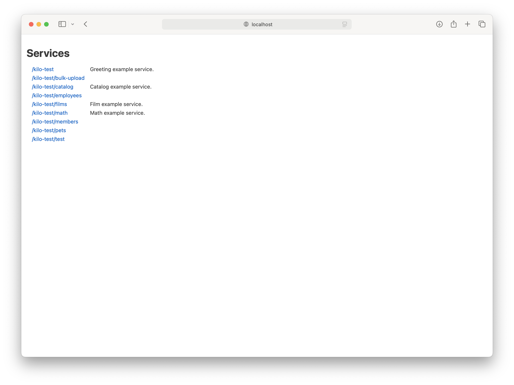
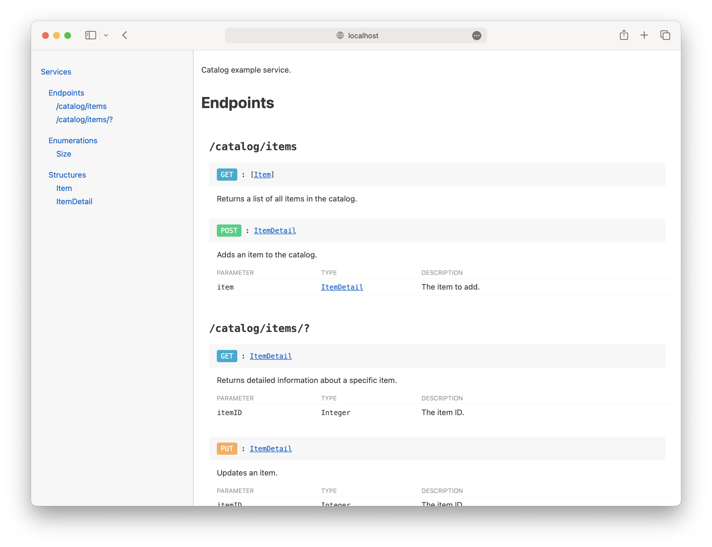

[](https://github.com/HTTP-RPC/Kilo/releases)
[](https://repo1.maven.org/maven2/org/httprpc/kilo-client/)
[](https://javadoc.io/doc/org.httprpc/kilo-client)

# Introduction
Kilo is an open-source framework for creating and consuming RESTful and REST-like web services in Java. It is extremely lightweight and requires only a Java runtime environment and a servlet container. The project's name comes from the nautical _K_ or _Kilo_ flag, which means "I wish to communicate with you":


This guide introduces the Kilo framework and provides an overview of its key features.

# Contents
* [Getting Kilo](#getting-kilo)
* [Kilo Classes](#kilo-classes)
* [Additional Information](#additional-information)

# Getting Kilo
Kilo is distributed via Maven Central: 

* [org.httprpc:kilo-client](https://repo1.maven.org/maven2/org/httprpc/kilo-client/) - includes support for consuming web services, interacting with relational databases, and working with common file formats (Java 17 or later required)
* [org.httprpc:kilo-server](https://repo1.maven.org/maven2/org/httprpc/kilo-server/) - depends on client; includes support for creating web services (Jakarta Servlet specification 5.0 or later required)

# Kilo Classes
Classes provided by the Kilo framework include:

* [WebService](#webservice)
* [WebServiceProxy](#webserviceproxy)
* [JSONEncoder and JSONDecoder](#jsonencoder-and-jsondecoder)
* [TextEncoder and TextDecoder](#textencoder-and-textdecoder)
* [CSVEncoder](#csvencoder)
* [TemplateEncoder](#templateencoder)
* [BeanAdapter](#beanadapter)
* [QueryBuilder and ResultSetAdapter](#querybuilder-and-resultsetadapter)
* [ElementAdapter](#elementadapter)
* [Pipe](#pipe)
* [Collections and Optionals](#collections-and-optionals)

Each is discussed in more detail below.

## WebService
`WebService` is an abstract base class for web services. It extends the similarly abstract `HttpServlet` class and provides a thin, REST-oriented layer on top of the standard [servlet API](https://jakarta.ee/specifications/servlet/5.0/). 

For example, the following service implements some simple mathematical operations:

```java
@WebServlet(urlPatterns = {"/math/*"}, loadOnStartup = 1)
@Description("Math example service.")
public class MathService extends WebService {
    @RequestMethod("GET")
    @ResourcePath("sum")
    @Description("Calculates the sum of two numbers.")
    public double getSum(
        @Description("The first number.") double a,
        @Description("The second number.") double b
    ) {
        return a + b;
    }

    @RequestMethod("GET")
    @ResourcePath("sum")
    @Description("Calculates the sum of a list of numbers.")
    public double getSum(
        @Description("The numbers to add.") List<Double> values
    ) {
        var total = 0.0;

        for (var value : values) {
            total += value;
        }

        return total;
    }
}
```

The `RequestMethod` annotation associates an HTTP verb such as `GET` or `POST` with a service method, or "handler". The optional `ResourcePath` annotation associates a handler with a specific path, or "endpoint", relative to the servlet. `WebService` selects the best method to execute based on the values provided by the caller. For example, this request would invoke the first method:

```
GET /math/sum?a=2&b=4
```
 
while this would invoke the second:

```
GET /math/sum?values=1&values=2&values=3
```

In either case, the service would return the value 6 in response. 

The optional `Description` annotation is used to document a service implementation and is discussed in more detail [later](#api-documentation).

### Method Parameters
Method parameters may be any of the following types:

* `Byte`/`byte`
* `Short`/`short`
* `Integer`/`int`
* `Long`/`long`
* `Float`/`float`
* `Double`/`double`
* `Boolean`/`boolean`
* `Character`/`char`
* `String`
* `java.net.URI`
* `java.nio.file.Path`
* `java.time.Instant`
* `java.time.LocalDate`
* `java.time.LocalTime`
* `java.time.LocalDateTime`
* `java.time.Duration`
* `java.time.Period`
* `java.util.Date`
* `java.util.UUID`

The following multi-value types are also supported:

* `java.util.List`
* `java.util.Set`
* array/varargs

Additionally, `java.util.Map`, bean, and record types are supported for [body content](#body-content). Arguments of type `jakarta.servlet.http.Part` may be used with `POST` requests submitted as [multi-part form data](https://jakarta.ee/specifications/servlet/5.0/jakarta-servlet-spec-5.0#_MultipartConfig).

Unspecified values are automatically converted to `0`, `false`, or the null character for primitive types. `Date` values are decoded from a long value representing epoch time in milliseconds. Other values are parsed from their string representations.

`List`, `Set`, and array elements are automatically converted to their declared types. If no values are provided for a list, set, or array parameter, an empty instance (not `null`) will be passed to the method.

If a provided value cannot be coerced to the expected type, an HTTP 403 (forbidden) response will be returned. If no method is found that matches the provided arguments, HTTP 405 (method not allowed) will be returned.

Note that service classes must be compiled with the `-parameters` flag so that parameter names are available at runtime.

#### Required Parameters
Parameters that must be provided by the caller can be indicated by the `Required` annotation. For example, the following service method accepts a single required `owner` argument:

```java
@RequestMethod("GET")
public List<Pet> getPets(@Required String owner) throws SQLException { 
    ... 
}
```

`List`, `Set`, and array parameters are implicitly required, since these values will never be `null` (though they may be empty). For all other parameter types, HTTP 403 will be returned if a required value is not provided.

#### Custom Parameter Names
The `Name` annotation can be used to associate a custom name with a method parameter. For example:

```java
@WebServlet(urlPatterns = {"/members/*"}, loadOnStartup = 1)
public class MemberService extends WebService {
    @RequestMethod("GET")
    public List<Person> getMembers(
        @Name("first_name") String firstName,
        @Name("last_name") String lastName
    ) {
        ...
    }
}
```

This method could be invoked as follows: 

```
GET /members?first_name=foo*&last_name=bar*
```

### Path Variables
Path variables (or "keys") are specified by a "?" character in a handler's resource path. For example, the `itemID` argument in the method below is provided by a path variable:

```java
@RequestMethod("GET")
@ResourcePath("items/?")
@Description("Returns detailed information about a specific item.")
public ItemDetail getItem(
    @Description("The item ID.") Integer itemID
) throws SQLException { ... }
```

Path parameters must precede query parameters in the method signature and are implicitly required. Values are mapped to method arguments in declaration order.

### Body Content
Body content may be declared as the final parameter in a `POST` or `PUT` handler. For example, this method accepts an item ID as a path variable and an instance of `ItemDetail` as a body argument:

```java
@RequestMethod("PUT")
@ResourcePath("items/?")
@Description("Updates an item.")
public void updateItem(
    @Description("The item ID.") Integer itemID,
    @Description("The updated item.") ItemDetail item
) throws SQLException { ... }
```

Like path parameters, body parameters are implicitly required. By default, content is assumed to be JSON and is automatically converted to the appropriate type. Subclasses can override the `decodeBody()` method to perform custom conversions.

A body parameter of type `Void` may be used to indicate that the handler will process the input stream directly, as discussed [below](#request-and-repsonse-properties).

### Return Values
Return values are converted to JSON as follows:

* `Number`/numeric primitive: number
* `Boolean`/`boolean`: boolean
* `CharSequence`: string
* `java.util.Date`: number representing epoch time in milliseconds
* `Iterable`: array
* `java.util.Map`, bean, or record type: object

Additionally, instances of the following types are automatically converted to their string representations:

* `Character`/`char`
* `Enum`
* `java.net.URI`
* `java.nio.file.Path`
* `java.time.TemporalAccessor`
* `java.time.TemporalAmount`
* `java.util.UUID`

By default, an HTTP 200 (OK) response is returned when a service method completes successfully. However, if the method is annotated with `Creates`, HTTP 201 (created) will be returned instead. If the method is annotated with `Accepts`, HTTP 202 (accepted) will be returned. If the handler's return type is `void` or `Void`, HTTP 204 (no content) will be returned.

If a service method returns `null`, an HTTP 404 (not found) response will be returned.

Although return values are encoded as JSON by default, subclasses can override the `encodeResult()` method of the `WebService` class to support alternative representations. See the method documentation for more information.

### Request and Repsonse Properties
The following methods provide access to the request and response objects associated with the current invocation:

```java
protected HttpServletRequest getRequest() { ... }
protected HttpServletResponse getResponse() { ... }
```

For example, a service might use the request to read directly from the input stream, or use the response to return a custom header.

The response object can also be used to produce a custom result. If a service method commits the response by writing to the output stream, the method's return value (if any) will be ignored by `WebService`. This allows a service to return content that cannot be easily represented as JSON, such as image data.

### Exceptions
If an exception is thrown by a service method and the response has not yet been committed, the exception message (if any) will be returned as plain text in the response body. Error status is determined as follows:

* `IllegalArgumentException` or `UnsupportedOperationException` - HTTP 403 (forbidden)
* `NoSuchElementException` - HTTP 404 (not found)
* `IllegalStateException` - HTTP 409 (conflict)
* Any other exception - HTTP 500 (internal server error)

Subclasses can override the `reportError()` method to perform custom error handling.

### Inter-Service Communication
A reference to any active service can be obtained via the `getInstance()` method of the `WebService` class. This can be useful when the implementation of one service depends on functionality provided by another service, for example.

### API Documentation
An index of all active services can be found at the application's context root:

```
GET http://localhost:8080/kilo-test/
```



Documentation for a specific service can be viewed by appending "?api" to the service's base URL:

```
GET http://localhost:8080/kilo-test/catalog?api
```



Implementations can provide additional information about service types and operations using the `Description` annotation. For example:

```java
@WebServlet(urlPatterns = {"/catalog/*"}, loadOnStartup = 1)
@Description("Catalog example service.")
public class CatalogService extends AbstractDatabaseService {
    @RequestMethod("GET")
    @ResourcePath("items")
    @Description("Returns a list of all items in the catalog.")
    public List<Item> getItems() throws SQLException {
        ...
    }
    
    ...
}
```

Descriptions can also be associated with bean types, enums, and records:

```java
@Table("item")
@Description("Represents an item in the catalog.")
public interface Item {
    @Name("id")
    @Column("id")
    @PrimaryKey
    @Description("The item's ID.")
    Integer getID();
    void setID(Integer id);

    @Column("description")
    @Index
    @Description("The item's description.")
    @Required
    String getDescription();
    void setDescription(String description);

    @Column("price")
    @Description("The item's price.")
    @Required
    Double getPrice();
    void setPrice(Double price);
}
```

```java
@Description("Represents a size option.")
public enum Size implements Numeric {
    @Description("A small size.")
    SMALL(10),
    @Description("A medium size.")
    MEDIUM(20),
    @Description("A large size.")
    LARGE(30);

    private final int value;

    Size(int value) {
        this.value = value;
    }

    @Override
    public int value() {
        return value;
    }
}
```  

```java
@Description("Represents an x/y coordinate pair.")
public record Coordinates(
    @Description("The x-coordinate.") @Required int x,
    @Description("The y-coordinate.") @Required int y
) {
}
```

The `FormData` annotation can be used to indicate that a method accepts [form data](https://www.w3.org/TR/html401/interact/forms.html#h-17.13.4). Types or methods annotated as `Deprecated` will be identified as such in the output.

A JSON version of the generated documentation can be obtained by specifying an "Accept" type of "application/json" in the request headers. The response can be used to process an API definition programatically; for example, to generate client-side stub code. 

## WebServiceProxy
The `WebServiceProxy` class is used to submit API requests to a server. It provides the following constructor, which accepts a string representing the HTTP method to execute and the URI of the requested resource:

```java
public WebServiceProxy(String method, URI uri) { ... }
```

Query arguments are specified via a map passed to the `setArguments()` method. Any value may be used as an argument and will generally be encoded using its string representation. However, `Date` instances are first converted to a long value representing epoch time in milliseconds. Additionally, `Collection` or array instances represent multi-value parameters and behave similarly to `<select multiple>` tags in HTML forms.

Body content is specified via the `setBody()` method. By default, it will be serialized as JSON; however, the `setRequestHandler()` method can be used to facilitate alternate encodings:

```java
public interface RequestHandler {
    String getContentType();
    void encodeRequest(Object body, OutputStream outputStream) throws IOException;
}
```

For example, the `WebServiceProxy.FormDataRequestHandler` class submits requests as form data. When using the multi-part encoding (the default), instances of `java.nio.file.Path` represent file uploads and behave similarly to `<input type="file">` tags in HTML.

Service operations are invoked via the following method:

```java
public Object invoke() throws IOException { ... }
```

By default, response content is assumed to be JSON. The `setResponseHandler()` method can be used to decode alternate representations:

```java
public interface ResponseHandler {
    Object decodeResponse(InputStream inputStream, String contentType) throws IOException;
}
```

If an operation does not complete successfully, the default error handler will throw a `WebServiceException` (a subclass of `IOException`). If the type of the error response is "text/plain", the response content will be provided in the exception message. 

A custom error handler can be provided via `setErrorHandler()`:

```java
public interface ErrorHandler {
    void handleResponse(InputStream errorStream, String contentType, int statusCode) throws IOException;
}
```

The following code demonstrates how `WebServiceProxy` might be used to access the operations of the simple math service discussed [earlier](#webservice):

```java
// GET /math/sum?a=2&b=4
var webServiceProxy = new WebServiceProxy("GET", baseURI.resolve("math/sum"));

webServiceProxy.setArguments(mapOf(
    entry("a", 4),
    entry("b", 2)
));

System.out.println(webServiceProxy.invoke()); // 6.0
```

```java
// GET /math/sum?values=1&values=2&values=3
var webServiceProxy = new WebServiceProxy("GET", baseURI.resolve("math/sum"));

webServiceProxy.setArguments(mapOf(
    entry("values", listOf(1, 2, 3))
));

System.out.println(webServiceProxy.invoke()); // 6.0
```

`POST`, `PUT`, and `DELETE` operations are also supported. The `listOf()` and `mapOf()` methods are discussed in more detail [later](#collections-and-optionals).

### Typed Invocation
`WebServiceProxy` additionally provides the following methods to facilitate convenient, type-safe access to web APIs:

```java
public static <T> T of(Class<T> type, URI baseURI) { ... }
public static <T> T of(Class<T> type, URI baseURI, Map<String, Object> headers) { ... }
```

Both versions return an implementation of a given interface that submits requests to the provided URI. An optional map accepted by the second version can be used to provide common request headers.

The optional `ServicePath` annotation can be used to associate a base path with a proxy type. The `RequestMethod` and `ResourcePath` annotations are used as described [earlier](#webservice) for `WebService`. Proxy methods must include a throws clause that declares `IOException`, so that callers can handle unexpected failures. For example:

```java
@ServicePath("math")
public interface MathServiceProxy {
    @RequestMethod("GET")
    @ResourcePath("sum")
    double getSum(double a, double b) throws IOException;

    @RequestMethod("GET")
    @ResourcePath("sum")
    double getSum(List<Double> values) throws IOException;

    default double getAverage(List<Double> values) throws IOException {
        return getSum(values) / values.size();
    }
}
```

```java
var mathServiceProxy = WebServiceProxy.of(MathServiceProxy.class, baseURI);

System.out.println(mathServiceProxy.getSum(4, 2)); // 6.0
System.out.println(mathServiceProxy.getSum(listOf(1.0, 2.0, 3.0))); // 6.0

System.out.println(mathServiceProxy.getAverage(listOf(1.0, 2.0, 3.0, 4.0, 5.0))); // 3.0
```

The [`Name`](#custom-parameter-names) and [`Required`](#required-parameters) annotations may also be applied to proxy method parameters. 

Path variables and body content are handled as described for [`WebService`](#webservice). Body parameters are required for `POST` and `PUT` methods. A body parameter of type `Void` may be used to indicate that a method does not accept a body.

Note that proxy types must be compiled with the `-parameters` flag so their method parameter names are available at runtime.

## JSONEncoder and JSONDecoder
The `JSONEncoder` and `JSONDecoder` classes are used internally by `WebService` and `WebServiceProxy` to process request and response data. However, they can also be used directly by application logic. For example:

```java
var map = mapOf(
    entry("vegetables", listOf(
        "carrots", 
        "peas", 
        "potatoes"
    )),
    entry("desserts", listOf(
        "cookies",
        "cake",
        "ice cream"
    ))
);

try (var outputStream = Files.newOutputStream(file)) {
    var jsonEncoder = new JSONEncoder();

    jsonEncoder.write(map, outputStream);
}

try (var inputStream = Files.newInputStream(file)) {
    var jsonDecoder = new JSONDecoder();

    map = (Map<String, List<String>>)jsonDecoder.read(inputStream);
}

System.out.println(map.get("vegetables").get(0)); // carrots
```

## TextEncoder and TextDecoder
The `TextEncoder` and `TextDecoder` classes can be used to write and read plain text content, respectively. For example:

```java
var text = "Hello, World!";

try (var outputStream = Files.newOutputStream(file)) {
    var textEncoder = new TextEncoder();

    textEncoder.write(text, outputStream);
}

try (var inputStream = Files.newInputStream(file)) {
    var textDecoder = new TextDecoder();

    text = textDecoder.read(inputStream);
}

System.out.println(text); // Hello, World!
```

## CSVEncoder
The `CSVEncoder` class serializes a sequence of map or bean values to CSV. The list passed to the constructor represents both the names of the columns in the output document and the keys or properties to which those columns correspond. For example:

```java
var maps = listOf(
    mapOf(
        entry("a", "hello"),
        entry("b", 123),
        entry("c", true)
    ),
    mapOf(
        entry("a", "goodbye"),
        entry("b", 456),
        entry("c", false)
    )
);

var csvEncoder = new CSVEncoder(listOf("a", "b", "c"));

csvEncoder.write(maps, System.out);
```

This code would produce the following output:

```csv
"a","b","c"
"hello",123,true
"goodbye",456,false
```

String values are automatically wrapped in double-quotes and escaped. Instances of `java.util.Date` are encoded as a long value representing epoch time in milliseconds. All other values are encoded via `toString()`. 

## TemplateEncoder
The `TemplateEncoder` class transforms an object hierarchy (known as a "data dictionary") into an output format using a [template document](template-reference.md). Template syntax is based loosely on the [Mustache](https://mustache.github.io) specification and supports most Mustache features. 

`TemplateEncoder` provides the following constructors:

```java
public TemplateEncoder(URI uri) { ... }
public TemplateEncoder(Class<?> type, String name) { ... }
```

The first accepts the location of a template document as a `URI`. The second determines the location of the template via the provided type and resource name. 

For example, this code applies a template named "example.html" to a map instance:

```java
var map = mapOf(
    entry("a", "hello"),
    entry("b", 123),
    entry("c", true)
);

var templateEncoder = new TemplateEncoder(Examples.class, "example.html");

templateEncoder.write(map, System.out);
```

Given the following template as input:

```html
<html>
<body>
<p>{{a}}</p>
<p>{{b}}</p>
<p>{{c}}</p>
</body>
</html>
```

the code would produce this output:

```html
<html>
<body>
<p>hello</p>
<p>123</p>
<p>true</p>
</body>
</html>
```

## BeanAdapter
The `BeanAdapter` class provides access to Java bean properties via the `Map` interface. For example:

```java
var course = new Course();

course.setName("CS 101");
course.setBuilding("Technology Lab");
course.setRoomNumber(210);

var courseAdapter = new BeanAdapter(course);

System.out.println(courseAdapter.get("name")); // CS 101
System.out.println(courseAdapter.get("building")); // Technology Lab
System.out.println(courseAdapter.get("roomNumber")); // 210
```

`BeanAdapter` can also be used to facilitate type-safe access to loosely typed data structures:

```java
var map = mapOf(
    entry("name", "CS 101"),
    entry("building", "Technology Lab"),
    entry("roomNumber", 210)
);

var course = BeanAdapter.coerce(map, Course.class);

System.out.println(course.getName()); // CS 101
System.out.println(course.getBuilding()); // Technology Lab
System.out.println(course.getRoomNumber()); // 210
```

An interface can be used instead of a class to provide a strongly typed "view" of the underlying data. For example:

```java
public interface AssetPricing {
    Instant getDate();
    double getOpen();
    double getHigh();
    double getLow();
    double getClose();
    long getVolume();
}
```

```java
var map = mapOf(
    entry("date", "2024-04-08T00:00:00Z"),
    entry("open", 169.03),
    entry("close", 168.45),
    entry("high", 169.20),
    entry("low", 168.24),
    entry("volume", 37216858)
);

var assetPricing = BeanAdapter.coerce(map, AssetPricing.class);

System.out.println(assetPricing.getDate()); // 2024-04-08T00:00:00Z
System.out.println(assetPricing.getOpen()); // 169.03
System.out.println(assetPricing.getClose()); // 168.45
System.out.println(assetPricing.getHigh()); // 169.2
System.out.println(assetPricing.getLow()); // 168.24
System.out.println(assetPricing.getVolume()); // 37216858
```

### Required Properties
The `Required` annotation introduced [previously](#required-parameters) can also be used to indicate that a property must contain a value. For example:

```java
public class Vehicle {
    private String manufacturer;
    private Integer year;

    @Required
    public String getManufacturer() {
        return manufacturer;
    }

    public void setManufacturer(String manufacturer) {
        this.manufacturer = manufacturer;
    }

    @Required
    public Integer getYear() {
        return year;
    }

    public void setYear(Integer year) {
        this.year = year;
    }
}
```

Because both "manufacturer" and "year" are required, an attempt to coerce an empty map to a `Vehicle` instance would produce an `IllegalArgumentException`:

```java
var vehicle = BeanAdapter.coerce(mapOf(), Vehicle.class); // throws
```

Additionally, although the annotation will not prevent a caller from programmatically assigning a `null` value to either property, attempting to dynamically set an invalid value will generate an `IllegalArgumentException`:

```java
var vehicle = new Vehicle();

var vehicleAdapter = new BeanAdapter(vehicle);

vehicleAdapter.put("manufacturer", null); // throws
```

Similarly, attempting to dynamically access an invalid value will result in an `UnsupportedOperationException`:

```java
vehicleAdapter.get("manufacturer"); // throws
```

### Custom Property Names
The `Name` annotation introduced [previously](#custom-parameter-names) can also be used with bean properties. For example:

```java
public class Person {
    private String firstName = null;
    private String lastName = null;

    @Name("first_name")
    public String getFirstName() {
        return firstName;
    }

    public void setFirstName(String firstName) {
        this.firstName = firstName;
    }

    @Name("last_name")
    public String getLastName() {
        return lastName;
    }

    public void setLastName(String lastName) {
        this.lastName = lastName;
    }
}
```

The preceding class would be serialized to JSON like this:

```json
{
  "first_name": "John",
  "last_name": "Smith"
}
```

rather than this:

```json
{
  "firstName": "John",
  "lastName": "Smith"
}
```

## QueryBuilder and ResultSetAdapter
The `QueryBuilder` class provides support for programmatically constructing and executing SQL queries. For example, given the following tables (adapted from the MySQL tutorial):

```sql
create table owner (
    name varchar(20),
    primary key (name)
);
```

```sql
create table pet (
    name varchar(20),
    owner varchar(20),
    species varchar(20),
    sex char(1),
    birth date,
    death date,
    primary key (name),
    foreign key (owner) references owner(name)
);
```

this code could be used to create a query that returns all rows associated with a particular owner:

```java
var queryBuilder = new QueryBuilder();

queryBuilder.appendLine("select * from pet where owner = :owner order by name");
```

The colon character identifies "owner" as a parameter, or variable. Parameter values, or arguments, can be passed to `QueryBuilder`'s `executeQuery()` method as shown below:

```java
try (var statement = queryBuilder.prepare(getConnection());
    var results = queryBuilder.executeQuery(statement, mapOf(
        entry("owner", owner)
    ))) {
    ...
}
```

The `ResultSetAdapter` type returned by `executeQuery()` provides access to the contents of a JDBC result set via the `Iterable` interface. Individual rows are represented by `Map` instances produced by the adapter's iterator. The results could be coerced to a list of `Pet` instances and returned to the caller, or used as the data dictionary for a template document:

```java
return results.stream().map(result -> BeanAdapter.coerce(result, Pet.class)).toList();
```

```java
var templateEncoder = new TemplateEncoder(getClass(), "pets.xml");

templateEncoder.write(results, response.getOutputStream());
```

### Schema Annotations
`QueryBuilder` also offers a simplified approach to query construction using "schema annotations". For example, given these type definitions:

```java
@Table("owner")
public interface Owner {
    @Column("name")
    @PrimaryKey
    @Index
    String getName();
}
```

```java
@Table("pet")
public interface Pet {
    @Column("name")
    @PrimaryKey
    @Index
    String getName();

    @Column("owner")
    @ForeignKey(Owner.class)
    String getOwner();

    @Column("species")
    String getSpecies();

    @Column("sex")
    String getSex();

    @Column("birth")
    LocalDate getBirth();

    @Column("death")
    LocalDate getDeath();
}
```

the preceding query could be written as follows:

```java
var queryBuilder = QueryBuilder.select(Pet.class)
    .filterByForeignKey(Owner.class, "owner")
    .ordered(true);
```

The `Table` annotation associates an entity type with a database table. Similarly, the `Column` annotation associates a property with a column in the table. Both are used to create the "select" statement in the preceding example. The `PrimaryKey` and `ForeignKey` annotations represent relationships between entity types and are used to construct the "where" clause. The `Index` annotation indicates that a property is part of the default sort order for an entity and is used to construct the "order by" clause.

This code creates a query that selects all actors appearing in a particular film, identified by the "filmID" parameter:

```java
var queryBuilder = QueryBuilder.select(Actor.class)
    .join(FilmActor.class, Actor.class)
    .filterByForeignKey(FilmActor.class, Film.class, "filmID")
    .ordered(true);
```

Primary and foreign key annotations associated with the [`Actor`](https://github.com/HTTP-RPC/Kilo/blob/master/kilo-test/src/main/java/org/httprpc/kilo/test/Actor.java), [`Film`](https://github.com/HTTP-RPC/Kilo/blob/master/kilo-test/src/main/java/org/httprpc/kilo/test/Film.java), and [`FilmActor`](https://github.com/HTTP-RPC/Kilo/blob/master/kilo-test/src/main/java/org/httprpc/kilo/test/FilmActor.java) types are used to construct the "join" clause. The resulting query is functionally equivalent to the following SQL:

```sql
select actor.* from actor 
join film_actor on actor.actor_id = film_actor.actor_id 
where film_actor.film_id = :filmID
order by actor.last_name asc, actor.first_name asc
```

Insert, update, and delete operations are also supported. See the [pet](https://github.com/HTTP-RPC/Kilo/blob/master/kilo-test/src/main/java/org/httprpc/kilo/test/PetService.java), [catalog](https://github.com/HTTP-RPC/Kilo/blob/master/kilo-test/src/main/java/org/httprpc/kilo/test/CatalogService.java), and [film](https://github.com/HTTP-RPC/Kilo/blob/master/kilo-test/src/main/java/org/httprpc/kilo/test/FilmService.java) service examples for more information.

## ElementAdapter
The `ElementAdapter` class provides access to the contents of an XML DOM `Element` via the `Map` interface. For example, the following markup might be used to represent the status of a bank account:

```xml
<account id="101">
    <holder>
        <firstName>John</firstName>
        <lastName>Smith</lastName>
    </holder>
    <transactions>
        <credit>
            <amount>100.00</amount>
            <date>10/5/2024</date>
        </credit>
        <credit>
            <amount>50.00</amount>
            <date>10/12/2024</date>
        </credit>
        <debit>
            <amount>25.00</amount>
            <date>10/14/2024</date>
        </debit>
        <credit>
            <amount>75.00</amount>
            <date>10/19/2024</date>
        </credit>
    </transactions>
</account>
```

This code could be used to load the document and adapt the root element: 

```java
var documentBuilderFactory = DocumentBuilderFactory.newInstance();

documentBuilderFactory.setExpandEntityReferences(false);
documentBuilderFactory.setIgnoringComments(true);

var documentBuilder = documentBuilderFactory.newDocumentBuilder();

Document document;
try (var inputStream = getClass().getResourceAsStream("account.xml")) {
    document = documentBuilder.parse(inputStream);
}

var accountAdapter = new ElementAdapter(document.getDocumentElement());
```

Attribute values can be obtained by prepending an "@" symbol to the attribute name:

```java
var id = accountAdapter.get("@id");

System.out.println(id); // 101
```

Individual sub-elements can be accessed by name. The text content of an element can be obtained by calling `toString()` on the returned value; for example:

```java
var holder = (Map<String, Object>)accountAdapter.get("holder");

var firstName = holder.get("firstName");
var lastName = holder.get("lastName");

System.out.println(String.format("%s, %s", lastName, firstName)); // Smith, John
```

An element's text content can also be accessed via the reserved "." key.

Multiple sub-elements can be obtained by appending an asterisk to the element name:

```java
var transactions = (Map<String, Object>)accountAdapter.get("transactions");
var credits = (List<Map<String, Object>>)transactions.get("credit*");

for (var credit : credits) {
    System.out.println(credit.get("amount"));
    System.out.println(credit.get("date"));
}
```

`ElementAdapter` also supports `put()` and `remove()` for modifying an element's contents.

## Pipe
The `Pipe` class provides a vehicle by which a producer thread can submit a sequence of elements for retrieval by a consumer thread. It implements the `Iterable` interface and returns values as they become available, blocking if necessary.

For example, the following code executes a SQL query that retrieves all rows from an `employees` table:

```java
@Table("employees")
public interface Employee {
    @Column("emp_no")
    @PrimaryKey
    Integer getEmployeeNumber();

    @Column("first_name")
    @Required
    String getFirstName();

    @Column("last_name")
    @Required
    String getLastName();

    @Column("gender")
    @Required
    String getGender();

    @Column("birth_date")
    @Required
    LocalDate getBirthDate();

    @Column("hire_date")
    @Required
    LocalDate getHireDate();
}
```

```java
var queryBuilder = QueryBuilder.select(Employee.class);

try (var statement = queryBuilder.prepare(getConnection());
    var results = queryBuilder.executeQuery(statement)) {
    return results.stream().map(result -> BeanAdapter.coerce(result, Employee.class)).toList();
}
```

All of the rows are read and added to the list before anything is returned to the caller. For small result sets, the latency and memory implications associated with this approach might be acceptable. However, for larger data volumes the following alternative may be preferable. The query is executed on a background thread, and the transformed results are streamed back to the caller via a pipe:

```java
var pipe = new Pipe<Employee>(4096, 15000);

var connection = getConnection();

executorService.submit(() -> {
    var queryBuilder = QueryBuilder.select(Employee.class);

    try (var statement = queryBuilder.prepare(connection);
        var results = queryBuilder.executeQuery(statement)) {
        pipe.accept(results.stream().map(result -> BeanAdapter.coerce(result, Employee.class)));
    } catch (SQLException exception) {
        throw new RuntimeException(exception);
    }
});

return pipe;
```

The pipe is configured with a capacity of 4K elements and a timeout of 15s. Limiting the capacity ensures that the producer does not do more work than necessary if the consumer fails to retrieve all of the data. Similarly, specifying a timeout ensures that the consumer does not wait indefinitely if the producer stops submitting data.

This implementation is slightly more verbose than the first one. However, because no intermediate buffering is required, results are available to the caller sooner, and CPU and memory load is reduced.

For more information, see the [employee service](https://github.com/HTTP-RPC/Kilo/blob/master/kilo-test/src/main/java/org/httprpc/kilo/test/EmployeeService.java) example.

## Collections and Optionals
The `Collections` class provides a set of static utility methods for declaratively instantiating list, map, and set values:

```java
public static <E> List<E> listOf(E... elements) { ... }
public static <K, V> Map<K, V> mapOf(Map.Entry<K, V>... entries) { ... }
public static <K, V> Map.Entry<K, V> entry(K key, V value) { ... }
public static <E> Set<E> setOf(E... elements) { ... }
```

They offer an alternative to similar methods defined by the `List`, `Map`, and `Set` interfaces, which produce immutable instances and do not permit `null` values. The following immutable variants are also provided:

```java
public static <E> List<E> immutableListOf(E... elements) { ... }
public static <K, V> Map<K, V> immutableMapOf(Map.Entry<K, V>... entries) { ... }
public static <E> Set<E> immutableSetOf(E... elements) { ... }
```

`Collections` also includes support for declaring empty lists, maps, and sets:

```java
public static <E> List<E> emptyListOf(Class<E> elementType) { ... }
public static <K, V> Map<K, V> emptyMapOf(Class<K> keyType, Class<V> valueType) { ... }
public static <E> Set<E> emptySetOf(Class<E> elementType) { ... }
```

These methods can be used in place of similar methods defined by the `java.util.Collections` class:

```java
var list1 = java.util.Collections.<Integer>emptyList();
var list2 = emptyListOf(Integer.class);

var map1 = java.util.Collections.<String, Integer>emptyMap();
var map2 = emptyMapOf(String.class, Integer.class);

var set1 = java.util.Collections.<Integer>emptySet();
var set2 = emptySetOf(Integer.class);
```

The `Optionals` class contains methods for working with optional (or "nullable") values:

```java
public static <T> T coalesce(T... values) { ... }
public static <T, U> U map(T value, Function<? super T, ? extends U> transform) { ... }
public static <T> void perform(T value, Consumer<? super T> action) { ... }
```

These are provided as a less verbose alternative to similar methods defined by the `java.util.Optional` class:

```java
var value = 123;

var a = Optional.ofNullable(null).orElse(Optional.ofNullable(null).orElse(value)); // 123
var b = coalesce(null, null, value); // 123
```

```java
var value = "hello";

var a = Optional.ofNullable(value).map(String::length).orElse(null); // 5
var b = map(value, String::length); // 5
```

```java
var stringBuilder = new StringBuilder();

Optional.ofNullable("abc").ifPresent(stringBuilder::append); // abc
perform("def", stringBuilder::append); // abcdef
```

`Optionals` additionally provides the follwing method, which performs a "safe" cast:

```java
public static <T> T cast(Object value, Class<T> type) {
```

If the provided value is an instance of the requested type, the cast will succeed. Otherwise, the method will return `null`. For example:

```java
var text = cast("abc", String.class); // abc

var number = cast("abc", Double.class); // null
```

# Additional Information
This guide introduced the Kilo framework and provided an overview of its key features. For additional information, see the [examples](https://github.com/HTTP-RPC/Kilo/tree/master/kilo-test/src/main/java/org/httprpc/kilo/test).
